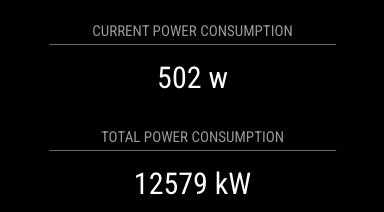

# MMM-MySqlData

A [MagicMirror²](https://magicmirror.builders) module to connect to a MySQL database, run a select query (one value) and display the result.



## Installation

Run these commands at the root of your MagicMirror² install:

```shell
cd modules
git clone https://github.com/tabsl/MMM-MySQLData.git
cd MMM-MySqlDATA
npm install
cd ../..
```


## Update

If you already have a version of MMM-MySqlDATA, run the following to pick up new code changes:

```shell
cd modules/MMM-MySqlDATA
git pull
npm install
```


## Using the module

Edit your `config/config.js` file and add a new object to the `modules` array like any other module:

```js
var config = {
    modules: [
        {
            module: "MMM-MySQLData",
            position: "top_center",
            config: {
                id: Math.floor(Math.random() * 100),
                host: "YOUR_HOST",
                username: "YOUR_USERNAME",
                password: "YOUR_PASSWORD",
                database: "YOUR_DATABASE_NAME",
                port: 3306,
                values: [
                    {
                        "id": "power_current",
                        "interval": 60000,
                        "title": "Current power consumption",
                        "praefix": "",
                        "suffix": " w",
                        "query": "SELECT round(data) AS value FROM power_consumption WHERE type = 'current' ORDER BY date DESC LIMIT 1",
                        "styles": {
                            "warn": "1000",
                            "alert": "10000"
                        }
                    },
                    {
                        "id": "power_total",
                        "interval": 720000,
                        "title": "Total power consumption",
                        "praefix": "",
                        "suffix": " kW",
                        "query": "SELECT round(data/1000) AS value FROM power_consumption WHERE type = 'total' ORDER BY date DESC LIMIT 1",
                    }
                ]
            }
        }
    ]
}
```

## Configuration options

| **Option**                  | **Type** | **Required** | **Description**                                                            |
|-----------------------------|----------|--------------|----------------------------------------------------------------------------|
| `id`                        | string   | yes          | Unique module instance id. Important if you use multiple module instances. |
| `host`                      | string   | yes          | Database host                                                              |
| `username`                  | string   | yes          | Database username                                                          |
| `password`                  | string   | yes          | Database password                                                          |
| `database`                  | string   | yes          | Database name                                                              |
| `port`                      | number   | no           | Database port (default: 3306)                                              |
| `header`                    | string   | no           | Module header                                                              |
| `values`                    | array    | yes          | Array for each database value to display                                   |
| `values[n].id`              | string   | yes          | Id (div)                                                                   |
| `values[n].interval`        | number   | yes          | Update interval (milliseconds)                                             |
| `values[n].title`           | string   | no           | Value header                                                               |
| `values[n].praefix`         | string   | no           | Value praefix                                                              |
| `values[n].suffix`          | string   | no           | Value suffix                                                               |
| `values[n].query`           | string   | yes          | MySQL query. **As a result, the column `value` must be returned!**         |
| `values[n].styles`          | array    | no           | Array for css styles                                                       |
| `values[n].styles[n].key`   | string   | no           | Css class name                                                             |
| `values[n].styles[n].value` | string   | no           | If database value greater then styles value, class is added.               |

## Styling

See (and edit) `MMM-MySQLData.css` or use `css/custom.css` to change module style settings.
